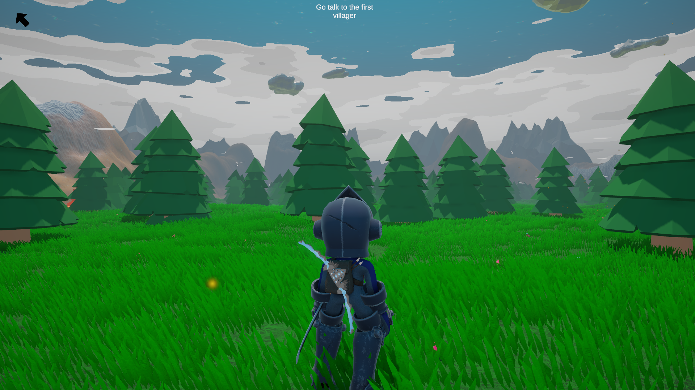
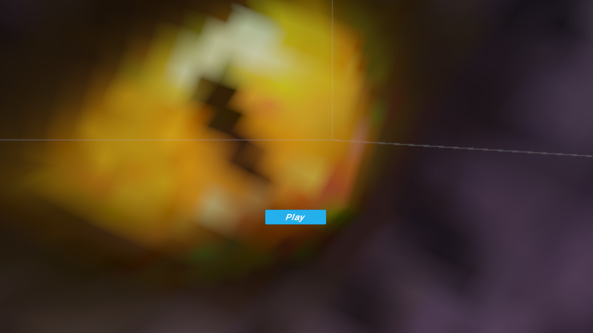

# Pyro's Adventure 🗡️🔥

Pyro-Adventure is a 3D action-adventure game made in Unity that follows the journey of **Pyro**, a brave knight on a quest to reclaim his kingdom.  
The peaceful realm was thrown into chaos when a **treacherous usurper** seized the throne, and Pyro must traverse dangerous landscapes, battle enemies, and overcome obstacles to defeat this dark ruler.

---

## 🎮 Features
- Player movement: walk, run, sprint, jump 
- Sword combat system with hit detection
- Enemy AI with damage response
- Health system with animations and VFX
- Main menu, game over screen, and in-game UI

---

## 🕹 Controls
| Key | Action |
|-----|--------|
| W | Move Forward |
| S | Move Backward |
| A | Strafe Left |
| D | Strafe Right |
| Left Shift | Sprint |
| Space | Jump |
| R | Sheathe and Unsheathe sword |
| Left Mouse Button | Sword Attack |
| Esc | Open / Close Menu |

---

## 🛠 Built With
- Unity 2026
- C#
- Built-in Render Pipeline

---

## 🎯 Goal of the Project
This project was created for learning purposes:  
- Player movement mechanics & animations  
- Sword combat and hitbox implementation  
- Enemy AI & damage systems  
- Terrain & texture-based interactions  
- UI & menu design    

---

## 🔍 Preview

### Gameplay Screenshot

### Main Menu

---

## 📚 References

### 🎮 Tutorials

1. Enemy AI – RPG Combat Series (YouTube)  
   https://www.youtube.com/watch?v=tbnUxXrRg4s :contentReference[oaicite:7]{index=7}

2. Full 3D Enemy AI in 6 Minutes (YouTube)  
   https://www.youtube.com/watch?v=UjkSFoLxesw :contentReference[oaicite:8]{index=8}

3. Unity Learn – AI Navigation  
   https://learn.unity.com/tutorial/adding-ai-navigation :contentReference[oaicite:9]{index=9}

### 🛠 Unity Official Docs

4. Unity UI Tutorials  
   https://unity3d.com/learn/tutorials/topics/user-interface-ui :contentReference[oaicite:10]{index=10}

5. Unity Audio Tutorials  
   https://unity3d.com/learn/tutorials/topics/audio :contentReference[oaicite:11]{index=11}

6. Unity Physics (Rigidbodies)  
   https://unity3d.com/learn/tutorials/topics/physics :contentReference[oaicite:12]{index=12}  

 

👨‍💻 **Developed by** – @Arijit2175
